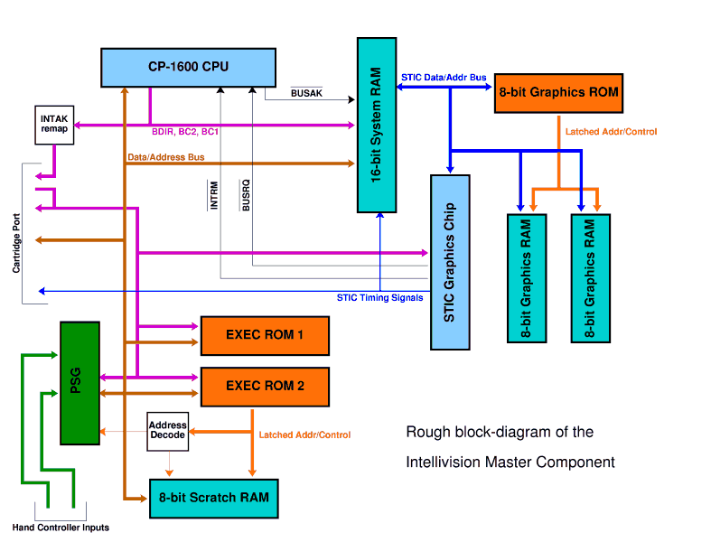
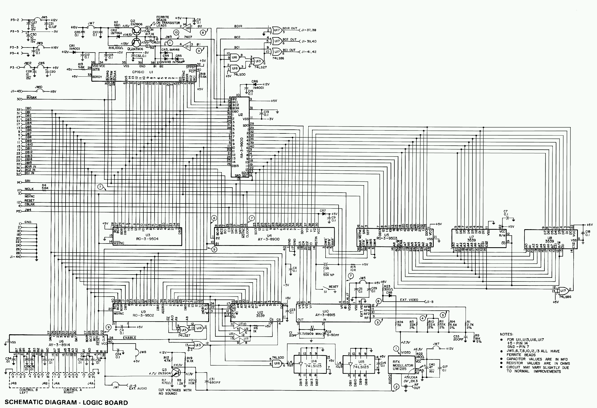
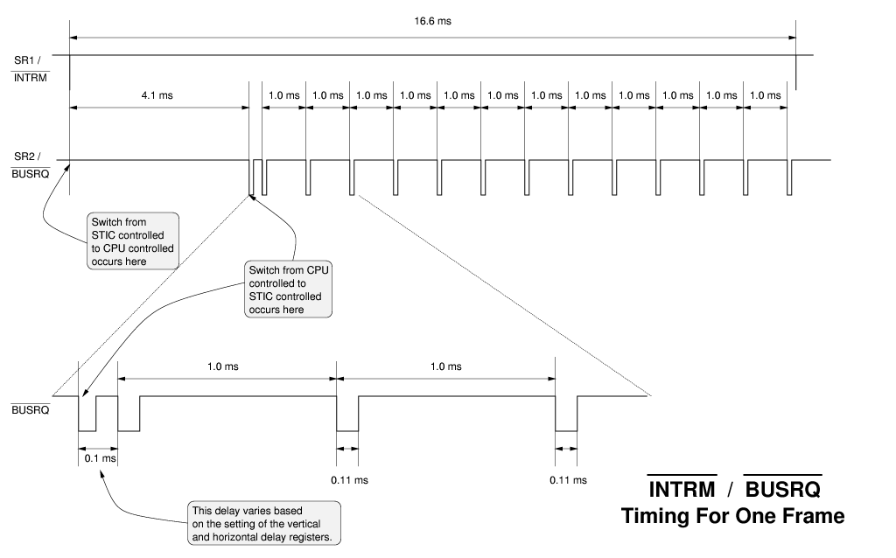
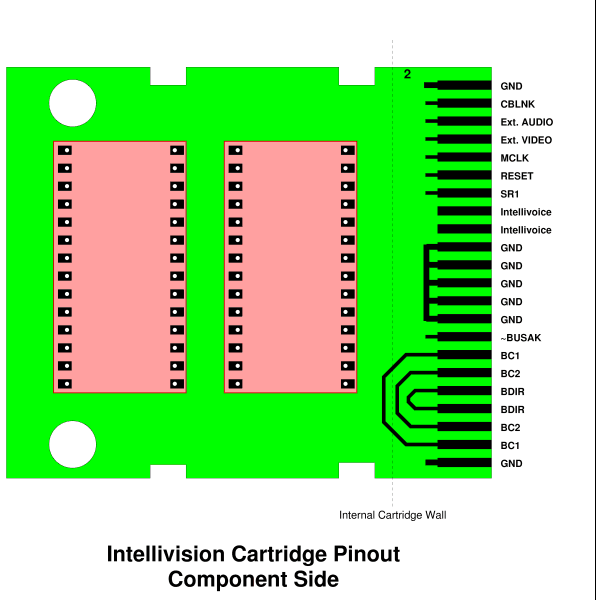
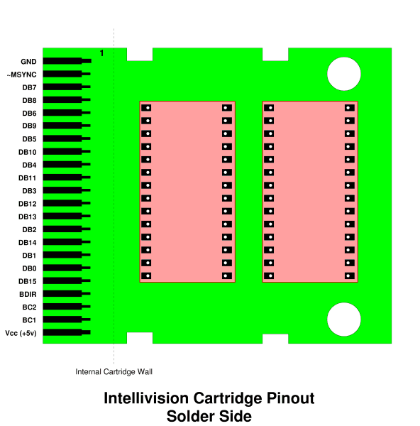

# Intellivision Master Component Hardware

------------------------------------------------------------------------

## Figures

|                                                                       |
|-----------------------------------------------------------------------|
|  |

**Slightly Simplified Block Diagram**

|                                                                                           |
|-------------------------------------------------------------------------------------------|
|                                            |
| Note: This image is courtesy of [Frank Palazzolo's 2bits website](http://www.dsplib.com/) |

**Intellivision I Schematic (from Sylvania Service Manual)**

------------------------------------------------------------------------

## Component Overview

| Part Number  | Description                                  | Notes                                                                                                                                                                                                                                                                                                                                |
|--------------|----------------------------------------------|--------------------------------------------------------------------------------------------------------------------------------------------------------------------------------------------------------------------------------------------------------------------------------------------------------------------------------------|
| CP-1610      | CPU                                          | This is the main CPU.                                                                                                                                                                                                                                                                                                                |
| RA-3-9600    | 16-bit System RAM                            | Contains 352 words of 16-bit memory. Also contains a second bus for interfacing to the STIC and its memory bus. The System RAM includes a special 20-word FIFO for shifting characters out to the STIC, and logic for interfacing the STIC and CPU to each other.                                                                    |
| RO-3-9504    | One-half of EXEC ROM (Intellivision 1 only)  | The EXEC ROM is stored in two 2Kx10-bit ROMs. This is one of them. On the Intellivision 2, these two ROMs are combined into a single ROM.                                                                                                                                                                                            |
| AY-3-8900    | Standard Television Interface Circuit        | This chip generates the display signals from the card information stored in System RAM, and the graphics patterns stored in the Graphics ROM and Graphics RAM. It does not generate NTSC directly; rather it drives the "Color Processor" chip to generate the NTSC line levels.                                                     |
| RO-3-9503    | Graphics ROM                                 | This 2048 x 8-bit ROM stores the built-in graphics for the Intellivision. The ROM provides special control signals for controlling the graphics RAM. This includes address decode, read strobe and write strobe signals.                                                                                                             |
| two GTE 3539 | Graphics RAM                                 | These two RAMs combine together to provide 512 bytes of programmable graphics patterns for games. They are controlled by special hardware in the Graphics ROM which performs a decode of the STIC's memory bus.                                                                                                                      |
| RO-3-9502    | One-half of EXEC ROM (Intellivision 1 only). | This ROM provides the other half of the EXEC. It also provides address and bus signal decoding for the 8-bit scratchpad RAM and the Programmable Sound Generator. On the Intellivision 2, this ROM is combined with the RO-3-9504 (above) into a single 4.25K ROM.                                                                   |
| GTE-3539     | 8-bit Scratchpad RAM                         | This provides 240 usable words of scratchpad RAM. In order to simplify the address decoding logic, the upper 16 bytes of this RAM's address space have been replaced with the Programmable Sound Generator's address space instead.                                                                                                  |
| AY-3-8915    | Color Processor Chip                         | This device takes the pixel-rate 5-bit input from the STIC and converts it into an NTSC rate signal. It outputs four I/Q phases for every STIC pixel (eg. +I, +Q, -I, -Q). The lower 4 bits specify one of the Inty's familiar 16 colors. The 5th bit is used to specify other NTSC signal states such as blanking, colorburst, etc. |
| AY-3-8914    | Programmable Sound Generator                 | This is the sound chip. It provides 3 tone voices and one noise channel that can be mixed into the tone channels. It also provides two 8-bit bidirectional ports which are used for the Intellivision's controller pads.                                                                                                             |

Chips present in the Master Component (aside from misc discrete logic). These are taken in left-to-right, top-to-bottom order from the Intellivision schematics.

------------------------------------------------------------------------

## System Architecture

The Intellivision Master Component is built around two main data busses, the CPU Address/Data bus and the STIC Address/Data bus. Both busses are time-multiplexed between address and data, and both have a number of specialized control signals associated with them.

### System Architecture :: The CPU Bus

The CPU Address/Data bus has 16 Address/Data Lines named `DB0` through DB15, and three control lines named `BDIR`, `BC2`, and `BC1.` (Additionally, the active low signals `~BUSRQ` and `~BUSAK` are available for Direct Memory Access requests. These are discussed later.)

The CPU Bus originates at the CP-1600 CPU, and is directly connected to the 16-bit System RAM, 8-bit Scratchpad RAM, the PSG, the STIC, and the various program ROMs in the system. It does not connect directly to the GRAM or GROM, as these are controlled via the STIC. (Communication between the STIC bus and the CPU bus is described later.)

Because the CPU Bus is time-multiplexed between Address and Data values, it relies on external devices to latch addresses during one bus phase before performing the access in a later bus phase. The value on the `BDIR/BC2/BC1` control lines designates the current phase for the CPU bus. As there are 3 control lines, there are 8 bus phases defined. These are described in the following table:

| `BDIR` | `BC2` | `BC1` | Mnemonic | Name                                             | Description                                                                                                                                                                                                                                                                                                                                                                                                                                                                                                                                                                                                                                                     |
|--------|-------|-------|----------|--------------------------------------------------|-----------------------------------------------------------------------------------------------------------------------------------------------------------------------------------------------------------------------------------------------------------------------------------------------------------------------------------------------------------------------------------------------------------------------------------------------------------------------------------------------------------------------------------------------------------------------------------------------------------------------------------------------------------------|
| 0      | 0     | 0     | `NACT`   | **N**o **ACT**ion                                | During this stage, no device is active on the bus. DB0 through DB15 are allowed to float, with their previous driven value fading away during this phase.                                                                                                                                                                                                                                                                                                                                                                                                                                                                                                       |
| 0      | 0     | 1     | `ADAR`   | **A**ddress **D**ata to **A**ddress **R**egister | This bus phase is issued by the CPU during a Direct Addressing Mode instruction. Prior to this phase, an address will have been latched in a device by a prior `BAR` or `ADAR` bus phase. Then, during this phase, the currently selected device responds with its data on the bus, and at the end of this phase, all devices should latch this address as the address for the next memory access (`DTB`, `DW`, or `DWS` phases). The CPU asserts nothing during this phase -- rather, it expects the currently addressed device to inform the rest of the machine of the address for the next access.                                                          |
| 0      | 1     | 0     | `IAB`    | **I**nterrupt **A**ddress to **B**us             | This bus phase is entered during interrupt processing, after the current program counter has been written to the stack. It's also entered into on the first cycle after coming out of RESET. During this phase, an external device should assert the address of the Interrupt or RESET vector as appropriate. The CPU then moves this address into the program counter and resumes execution.                                                                                                                                                                                                                                                                   |
| 0      | 1     | 1     | `DTB`    | **D**ata **T**o **B**us                          | This phase is entered during a read cycle. During this phase, the currently addressed device should assert its data on the bus. The CPU then reads this data.                                                                                                                                                                                                                                                                                                                                                                                                                                                                                                   |
| 1      | 0     | 0     | `BAR`    | **B**us to **A**ddress **R**egister              | During this phase, the CPU asserts the address for the current memory access. All devices on the bus are expected to latch this address and perform address decoding at this time.                                                                                                                                                                                                                                                                                                                                                                                                                                                                              |
| 1      | 0     | 1     | `DW`     | **D**ata **W**rite                               | The `DW` and `DWS` bus phases initiate a write cycle. They always occur together on adjacent cycles, with data remaining stable on the bus across the transition from `DW` to `DWS.` During these phases, the data being written is available for external memories to latch. The CP-1600 allows two full CPU cycles for external RAM to latch the data.                                                                                                                                                                                                                                                                                                        |
| 1      | 1     | 0     | `DWS`    | **D**ata **W**rite **S**trobe                    |                                                                                                                                                                                                                                                                                                                                                                                                                                                                                                                                                                                                                                                                 |
| 1      | 1     | 1     | `INTAK`  | **INT**errupt **A**c**K**nowledge                | The CPU enters this bus phase on the first cycle of interrupt processing. During the phase, the CPU places the current stack pointer value on the bus as it prepares to "push" the current program counter on the stack. Devices are expected to treat `INTAK` similarly to a BAR bus phase. Indeed, on the Intellivision Master Component, only the 16-bit System RAM sees the `INTAK` bus phase. It uses this bus phase to trigger a special bus-copy mode as well as for latching the current address. For all other devices in the system, `INTAK` is remapped to `BAR` by some discrete logic, and so is processed as a normal addressing cycle elsewhere. |

**General Instruments Bus Protocol**

While the table is well and good as a reference, it would be useful to illustrate how these phases are used. Also, the [CPU state-flow diagram](state_flow_diag.md) is very useful for understanding how these bus phases work.

The CP-1600's bus transactions typically last between 4 and 7 CPU cycles. Half of these cycles are `NACT` cycles, inserted as spacing cycles between the activity cycles. As a general rule, there is a `NACT` cycle inserted after every cycle EXCEPT in two specific cases. The first is between `DW` and `DWS,` which always occur back-to-back. The second is during an indirect access after an `SDBD` instruction, where the CPU omits `NACT` states after both `DTB`s.

The tables below illustrate the various bus transations, complete with a cycle-by-cycle description of the transaction.

|                                                        |        |                                                                                                                                                                                                                                         |     |     |                                                                                                                                                                                                                                                                       |         |                                                                                                                                                                                                                                                                                                                                                                                                                               |
|--------------------------------------------------------|--------|-----------------------------------------------------------------------------------------------------------------------------------------------------------------------------------------------------------------------------------------|-----|-----|-----------------------------------------------------------------------------------------------------------------------------------------------------------------------------------------------------------------------------------------------------------------------|---------|-------------------------------------------------------------------------------------------------------------------------------------------------------------------------------------------------------------------------------------------------------------------------------------------------------------------------------------------------------------------------------------------------------------------------------|
| Instruction Fetch or Indirect/Immediate-Mode Data Read |        |                                                                                                                                                                                                                                         |     |     | Indirect/Immediate-Mode Data Write                                                                                                                                                                                                                                    |         |                                                                                                                                                                                                                                                                                                                                                                                                                               |
| Cycle                                                  | Phase  | Description                                                                                                                                                                                                                             |     |     | Cycle                                                                                                                                                                                                                                                                 | Phase   | Description                                                                                                                                                                                                                                                                                                                                                                                                                   |
| 1                                                      | `BAR`  | CPU asserts address of the Instruction or Data to read. Devices should latch the address at this time and perform address decoding.                                                                                                     |     |     | 1                                                                                                                                                                                                                                                                     | `BAR`   | CPU asserts address of the Data to write. Devices should latch the address at this time and perform address decoding.                                                                                                                                                                                                                                                                                                         |
| 2                                                      | `NACT` | The CPU deasserts the bus, and no other bus activity occurs during this cycle.                                                                                                                                                          |     |     | 2                                                                                                                                                                                                                                                                     | `NACT`  | The CPU deasserts the bus, and no other bus activity occurs during this cycle.                                                                                                                                                                                                                                                                                                                                                |
| 3                                                      | `DTB`  | The addressed device asserts its data on the bus. The CPU then reads this data.                                                                                                                                                         |     |     | 3                                                                                                                                                                                                                                                                     | `DW`    | The CPU asserts the data to be written. The addressed device can latch the data at this time, although it is not necessary yet, as the data is stable through the next phase.                                                                                                                                                                                                                                                 |
|                                                        |        |                                                                                                                                                                                                                                         |     |     | 4                                                                                                                                                                                                                                                                     | `DWS`   | The CPU continues to assert the data to be written. The addressed device can latch the data at this time if it hasn't already.                                                                                                                                                                                                                                                                                                |
| 4                                                      | `NACT` | The device deasserts the bus, and no other bus activity occurs during this cycle.                                                                                                                                                       |     |     | 5                                                                                                                                                                                                                                                                     | `NACT`  | The CPU deasserts the bus, and no other bus activity occurs during this cycle.                                                                                                                                                                                                                                                                                                                                                |
|                                                        |        |                                                                                                                                                                                                                                         |     |     | \[Aside: Yes, the CP-1600 does have an "Immediate Mode Write", where it writes the contents of a register to an immediate operand. The reason for this is that "Immediate Mode" is really "Indirect Mode", using the program counter as the pointer register. Cute.\] |         |                                                                                                                                                                                                                                                                                                                                                                                                                               |
|                                                        |        |                                                                                                                                                                                                                                         |     |     |                                                                                                                                                                                                                                                                       |         |                                                                                                                                                                                                                                                                                                                                                                                                                               |
| Direct Addressing Mode Read                            |        |                                                                                                                                                                                                                                         |     |     | Direct Addressing Mode Write                                                                                                                                                                                                                                          |         |                                                                                                                                                                                                                                                                                                                                                                                                                               |
| Cycle                                                  | Phase  | Description                                                                                                                                                                                                                             |     |     | Cycle                                                                                                                                                                                                                                                                 | Phase   | Description                                                                                                                                                                                                                                                                                                                                                                                                                   |
| 1                                                      | `BAR`  | CPU asserts address of the Instruction or Data to read. Devices should latch the address at this time and perform address decoding.                                                                                                     |     |     | 1                                                                                                                                                                                                                                                                     | `BAR`   | CPU asserts address of the Data to write. Devices should latch the address at this time and perform address decoding.                                                                                                                                                                                                                                                                                                         |
| 2                                                      | `NACT` | The CPU deasserts the bus, and no other bus activity occurs during this cycle.                                                                                                                                                          |     |     | 2                                                                                                                                                                                                                                                                     | `NACT`  | The CPU deasserts the bus, and no other bus activity occurs during this cycle.                                                                                                                                                                                                                                                                                                                                                |
| 3                                                      | `ADAR` | The addressed device asserts the data that is at the location addressed during `BAR.` This data is then latched as an address by all devices for a subsequent `DTB` bus phase. The CPU remains off the bus during this cycle.           |     |     | 3                                                                                                                                                                                                                                                                     | `ADAR`  | The addressed device asserts the data that is at the location addressed during `BAR.` This data is then latched as an address by all devices for subsequent `DW` and `DWS` bus phase. The CPU remains off the bus during this cycle.                                                                                                                                                                                          |
| 4                                                      | `NACT` | The device deasserts the bus, and no other bus activity occurs during this cycle.                                                                                                                                                       |     |     | 4                                                                                                                                                                                                                                                                     | `NACT`  | The device deasserts the bus, and no other bus activity occurs during this cycle.                                                                                                                                                                                                                                                                                                                                             |
| 5                                                      | `DTB`  | The newly-addressed device (the one whose address was given during `ADAR`) asserts its data on the bus. The CPU then reads this data.                                                                                                   |     |     | 5                                                                                                                                                                                                                                                                     | `DW`    | The CPU asserts the data to be written. The newly-addressed device (the one whose address was given during `ADAR`) can latch the data at this time, although it is not necessary yet, as the data is stable through the next phase.                                                                                                                                                                                           |
|                                                        |        |                                                                                                                                                                                                                                         |     |     | 6                                                                                                                                                                                                                                                                     | `DWS`   | The CPU continues to assert the data to be written. The addressed device can latch the data at this time if it hasn't already.                                                                                                                                                                                                                                                                                                |
| 6                                                      | `NACT` | The device deasserts the bus, and no other bus activity occurs during this cycle.                                                                                                                                                       |     |     | 7                                                                                                                                                                                                                                                                     | `NACT`  | The CPU deasserts the bus, and no other bus activity occurs during this cycle.                                                                                                                                                                                                                                                                                                                                                |
|                                                        |        |                                                                                                                                                                                                                                         |     |     |                                                                                                                                                                                                                                                                       |         |                                                                                                                                                                                                                                                                                                                                                                                                                               |
| Indirect/Immediate Addressing Mode Read with `SDBD`    |        |                                                                                                                                                                                                                                         |     |     | Interrupt Processing                                                                                                                                                                                                                                                  |         |                                                                                                                                                                                                                                                                                                                                                                                                                               |
| Cycle                                                  | Phase  | Description                                                                                                                                                                                                                             |     |     | Cycle                                                                                                                                                                                                                                                                 | Phase   | Description                                                                                                                                                                                                                                                                                                                                                                                                                   |
| 1                                                      | `BAR`  | CPU asserts address of the lower byte of Data to read. Devices should latch the address at this time and perform address decoding.                                                                                                      |     |     | 1                                                                                                                                                                                                                                                                     | `INTAK` | The CPU asserts the current Stack Pointer address (the value in R6), and increments the stack pointer internally. Devices are expected to latch this address and decode it internally. Also, devices are expected to take any special interrupt-acknowledgement steps at this time. (On the Intellivision, this bus phase is remapped to `BAR` for most devices. The only device that sees `INTAK` is the 16-bit System RAM.) |
| 2                                                      | `NACT` | The CPU deasserts the bus, and no other bus activity occurs during this cycle.                                                                                                                                                          |     |     | 2                                                                                                                                                                                                                                                                     | `NACT`  | The CPU deasserts the bus, and no other bus activity occurs during this cycle.                                                                                                                                                                                                                                                                                                                                                |
| 3                                                      | `DTB`  | The addressed device asserts its data on the bus. The CPU then reads this data.                                                                                                                                                         |     |     | 3                                                                                                                                                                                                                                                                     | `DW`    | The CPU outputs the current program counter address. The device addressed during `INTAK` should latch the data either now or during the next cycle (`DWS`).                                                                                                                                                                                                                                                                   |
| 4                                                      | `BAR`  | The device deasserts the bus during the first quarter of this cycle, and the CPU asserts a new address for the upper byte of Data during the latter half of this cycle. Notice that there is no `NACT` spacing cycle before this `BAR`! |     |     | 4                                                                                                                                                                                                                                                                     | `DWS`   | The CPU continues to assert the current program counter address. If the addressed device hasn't done so already, it should latch the data now.                                                                                                                                                                                                                                                                                |
| 5                                                      | `NACT` | The CPU deasserts the bus, and no other bus activity occurs during this cycle.                                                                                                                                                          |     |     | 5                                                                                                                                                                                                                                                                     | `NACT`  | The CPU deasserts the bus, and no other bus activity occurs during this cycle.                                                                                                                                                                                                                                                                                                                                                |
| 6                                                      | `DTB`  | The addressed device asserts its data on the bus. The CPU then reads this data. As with cycle 3, there is no `NACT` spacing cycle after this cycle!                                                                                     |     |     | 6                                                                                                                                                                                                                                                                     | `IAB`   | An external device asserts the new program counter address (the address of the interrupt service routine) on the bus. The CPU latches this address and transfers it to the program counter. On the Intellivision, one of the EXEC ROMs handles the program counter address assertion.                                                                                                                                         |
|                                                        |        |                                                                                                                                                                                                                                         |     |     | 7                                                                                                                                                                                                                                                                     | `NACT`  | The device deasserts the bus, and no other bus activity occurs during this cycle.                                                                                                                                                                                                                                                                                                                                             |

### System Architecture :: The STIC Bus

The STIC bus is somewhat simpler than the CPU bus. The STIC bus originates at the STIC and extends to the 16-bit System RAM, the 8-bit Graphics ROM, and the 8-bit Graphics RAM. The bus itself is a 14-bit bus which multiplexes address and data in a manner similar to the CP-1600. What's interesting about the STIC bus is that it's used directly by the STIC during active display and indirectly by the CPU during vertical retrace. This will be covered in greater detail in the next section.

The STIC's bus protocol is an extreme subset of the CP-1600's. Rather than provide a 3-wire set of encoded bus controls, the STIC provides 3 decoded bus phase lines, `BAR'`, `DTB'`, and `DWS'`. Only one of these three lines is asserted at a time, to designate which bus phase the STIC is executing. (The `NACT` bus state exists when all three lines are de-asserted.) In addition to the bus control lines, the STIC provides three timing lines, `SR1`, `SR2` and `SR3` which are used to synchronize various events with respect to display time.

Transactions by the STIC are initiated by cycling the `BAR'`, `DTB'` and `DWS'` lines in approximately the same way that the CPU would do so. This is largely due to the fact that the STIC actually can act as intermediary for the CPU in some cases (as covered in the next section.) Nonetheless, there are some important differences:

- There aren't as many `NACT` cycles introduced by the STIC as there are by the CPU. Rather, `DTB'` is asserted as soon as `BAR'` is deasserted.

- During a write cycle, `DTB'` is momentarily asserted after `BAR'` until the STIC figures out that it's performing a write cycle. `DTB'` is deasserted and the STIC goes back to the `NACT` state before finally asserting `DWS` for a write.

The STIC bus itself is largely boring. During active display, the STIC is grabbing bits of display data from the System RAM, GRAM and GROM. During vertical retrace, the STIC bus serves as an extension of the CPU bus. This leads us to the next section.

### System Architecture :: Bridging the CPU and STIC busses

The System RAM is the key component which glues the STIC and CPU worlds together. Both the STIC and the CPU are bandwidth hogs, requiring unfettered access to large amounts of data. Yet they also need to communicate a great deal. The System RAM makes this possible by acting both as a bridge and as an isolator for the two busses.

The System RAM itself has two busses -- a 16-bit data/address bus on the CPU side and a 14-bit data/address bus on the STIC side. The CPU side bus speaks normal GI bus protocol, using `BC1`, `BC2` and `BDIR` control signals. The STIC side is much less flexible, serving alternately as a passthrough for the CPU bus in CPU-controlled mode, and as a state-machine-driven character output in STIC-controlled mode.

Outside of active display time, the STIC and System RAM work together to open the STIC bus up to CPU accesses. Upon seeing an `INTAK` bus cycle, the System RAM enters the so-called CPU controlled mode. In this mode, the System RAM acts as a bidirectional buffer, copying the lower 14 bits of the CPU bus over to the STIC bus in most cases, or from the STIC bus back to the CPU bus during a read. This bridges the two data/address buses. It does not handle the control signals, however.

During the CPU-controlled mode, the STIC performs bus decoding on behalf of the CPU bus, converting the 3-wire GI bus protocol into the decoded signals `BAR'`, `DTB'` and `DWS'` mentioned previously. These signals are fed on behalf of the CPU to the GRAM and GROM, thereby allowing the CPU access during this time to all of the peripherals that are on the STIC bus, namely the GRAMs, the GROM, and the STIC itself.

At the start of active display, the STIC issues a `~BUSRQ` to the CPU, requesting access to the bus. (`~BUSRQ` is tied to the `SR2` timing signal on the STIC.) The CPU responds after the first interruptible instruction by bringing `~BUSAK` low. The System RAM switches to STIC-controlled mode upon seeing the first `~BUSAK` high-to-low transition, thereby ending the bus-copying behavior of CPU-controlled mode.

\[Note that it is certainly possible that the CPU will *not* see this `~BUSRQ` phase if it is executing too many non-interruptible instructions in a row. In that scenario, the System RAM will remain in bus-copy mode, although the STIC has stopped decoding the bus-control signals for the CPU. The result is that the CPU still cannot access the STIC bus. If the CPU continues to ignore `~BUSRQ` during active display, the System RAM will remain in bus-copy mode and CPU will fight with the STIC over the bus. This is bad, as the System RAM and the STIC will both attempt to drive the STIC bus, leading to hardware fights and potential physical hardware failure. Not to mention that the display will be totally garbaged up.\]

In STIC controlled mode, the STIC bus side of the System RAM becomes a timing driven entity that is controlled through the `SR2` and `SR3` timing signals. While in STIC-controlled mode, the System RAM nearly completely isolates the CPU bus from the STIC bus, except when the STIC needs to access the System RAM. This is where `~BUSRQ` and `~BUSAK` come in to play. It only makes sense, then that the `~BUSAK` high-to-low transition (which is essentially a slightly time-delayed `SR2` transition) is what causes the System RAM to exit CPU-controlled mode and enter "buffer fill mode" for the STIC.

While `~BUSRQ` is active, the `SR3` signal is pulsed 20 times to trigger 20 reads to the display memory to read the next row of cards. (The STIC asserts `~BUSRQ` for this, because the System RAM is single-ported and can only be read by one device at a time.) This row's worth of values are read onto the STIC bus and into a separate 20 word buffer. Once the row is read into these buffer registers, `~BUSRQ` is released and the CPU is allowed to resume calculation. The row buffer is then subsequently read up to 15 more times (again, by pulsing `SR3`) for each of the scan-lines of the display in order to generate the row of cards on the screen, without disrupting the CPU's progress at all.

It's important to note: `~BUSRQ` does steal cycles from the CPU during active display. Some measurements place this penalty at almost 10% during active display. Altogether, there are between 13 and 14 `~BUSRQ`'s per frame (depending on the setting of the vertical delay register), with each lasting for approximately 110 CPU cycles. A minimum of 60 CPU cycles are required to read the 20 cards from System RAM, based on experimental evidence, which means that a correct program should have no more than about 40 cycles of non-interruptible instructions in a row. The figure below illustrates what a typical frame time looks like.

|                                                                                         |
|-----------------------------------------------------------------------------------------|
|  |

**Timing Diagram Showing `SR1` (`~INTRM`) and `~BUSRQ` Timing**

Using some simple timing that consist mostly of non-interruptible code, I've measured the following cycle counts for an NTSC Intellivision:

<table data-border="1" data-align="center" data-bgcolor="#CCDDEE">
<caption><strong>NTSC Intellivision Timing Parameters</strong></caption>
<colgroup>
<col style="width: 25%" />
<col style="width: 25%" />
<col style="width: 25%" />
<col style="width: 25%" />
</colgroup>
<thead>
<tr class="header">
<th>Parameter</th>
<th colspan="3" style="text-align: right;">Measurement</th>
</tr>
</thead>
<tbody>
<tr class="odd">
<td>NTSC Clock Rate</td>
<td colspan="2" style="text-align: right;"><code>3579545</code></td>
<td><code>Hz</code></td>
</tr>
<tr class="even">
<td>STIC Scanlines per Frame</td>
<td colspan="2" style="text-align: right;"><code>262</code></td>
<td><code>scanlines</code></td>
</tr>
<tr class="odd">
<td>Active Scanlines per Frame</td>
<td colspan="2" style="text-align: right;"><code>192</code></td>
<td><code>scanlines</code></td>
</tr>
<tr class="even">
<td>Actual Effective Frame Rate</td>
<td colspan="2" style="text-align: right;"><code>59.92</code></td>
<td><code>Hz</code></td>
</tr>
<tr class="odd">
<td>CP-1600 Clock Rate (NTSC/4)</td>
<td colspan="2" style="text-align: right;"><code>894886.25 Hz</code></td>
<td><code>Hz</code></td>
</tr>
<tr class="even">
<td rowspan="3">CPU Cycles per Frame 
</td>
<td style="text-align: right;">Display disabled:</td>
<td style="text-align: right;"><code>14934</code></td>
<td><code>cycles</code></td>
</tr>
<tr class="odd">
<td style="text-align: right;">Display enabled, vertical delay == 0:</td>
<td style="text-align: right;"><code>~13518</code></td>
<td><code>cycles</code></td>
</tr>
<tr class="even">
<td style="text-align: right;">Display enabled, vertical delay &gt; 0:</td>
<td style="text-align: right;"><code>~13572</code></td>
<td><code>cycles</code></td>
</tr>
<tr class="odd">
<td>CPU Cycles per Scanline</td>
<td colspan="2" style="text-align: right;"><code>57</code></td>
<td><code>cycles</code></td>
</tr>
<tr class="even">
<td>CPU Cycles available in Bus Copy mode</td>
<td colspan="2" style="text-align: right;"><code>3780 - 3790</code></td>
<td><code>cycles</code></td>
</tr>
</tbody>
</table>

**NTSC Intellivision Timing Parameters**

Additionally, I've worked out (with Kyle Davis' help) the following formulas for describing when various events (eg. `~BUSRQ` asserted) occur relative to the start of frame. All of these quantities are expressed in raw CPU cycles.

| Event                                                                           | Equation                                     |
|---------------------------------------------------------------------------------|----------------------------------------------|
| Switch from CPU-controlled to STIC-controlled                                   | `3790` (approx)                              |
| Assert` ~BUSRQ ` to fetch display row 0 through 11.                             | `3933 + 114*vertical_delay + 912*row_number` |
| De-assert` ~BUSRQ ` after fetching display row 0 through 11.                    | `4043 + 114*vertical_delay + 912*row_number` |
| Assert` ~BUSRQ ` to "fetch" extra row (occurs only if` vertical_delay == 0`).   | `14877`                                      |
| De-assert` ~BUSRQ ` after extra "fetch" (occurs only if` vertical_delay == 0`). | `14934`                                      |
| Assert` ~INTRM ` (aka.` SR1`)                                                   | `14934`                                      |

**NTSC Intellivision Timing Equations**

------------------------------------------------------------------------

## Interfacing

The Master Component interfaces to a variety of external devices, primarily through two sets of external links: the cartridge port and the hand controller ports. Game cartridges and most peripherals connect via the cartridge port, whereas the two hand controllers connect via the hand controller ports.

### Interfacing :: The Cartridge Port

The Master Component's cartridge port consists of a single 44-pin 0.1" spacing edge-card connector. A number of essential bus signals are brought out on this connector. The following figures illustrate which of these signals corresponds to each of the various cartridge pins. The table afterwards lists what each signal does.

|                                                                    |                                                                       |
|--------------------------------------------------------------------|-----------------------------------------------------------------------|
|  |  |

**Pin Mapping On Intellivision Cartridges**

|                                                                                     |               |     |     |                      |            |                                                                                                |
|-------------------------------------------------------------------------------------|---------------|-----|-----|----------------------|------------|------------------------------------------------------------------------------------------------|
| Component Side (Top)                                                                |               |     |     | Solder Side (Bottom) |            |                                                                                                |
| Description                                                                         | Name          | Pin |     | Pin                  | Name       | Description                                                                                    |
| Ground.                                                                             | ` GND `       | 2   |     | 1                    | ` GND `    | Ground.                                                                                        |
| Character BLaNK                                                                     | ` CBLNK `     | 4   |     | 3                    | ` ~MSYNC ` | Master SYNC.                                                                                   |
| External Audio Input.                                                               | ` Ext. AUDIO` | 6   |     | 5                    | ` DB7 `    | Bit 7 of the Address / Data Bus.                                                               |
| External Video Input.                                                               | ` Ext. VIDEO` | 8   |     | 7                    | ` DB8 `    | Bit 8 of the Address / Data Bus.                                                               |
| Master CLocK.                                                                       | ` MCLK `      | 10  |     | 9                    | ` DB6 `    | Bit 6 of the Address / Data Bus.                                                               |
| Reset input.                                                                        | ` RESET `     | 12  |     | 11                   | ` DB9 `    | Bit 9 of the Address / Data Bus.                                                               |
| Timing signal from the STIC.                                                        | ` SR1 `       | 14  |     | 13                   | ` DB5 `    | Bit 5 of the Address / Data Bus.                                                               |
| Intellivoice special purpose.                                                       | ` ??? `       | 16  |     | 15                   | ` DB10 `   | Bit 10 of the Address / Data Bus.                                                              |
|                                                                                     | ` ??? `       | 18  |     | 17                   | ` DB4 `    | Bit 4 of the Address / Data Bus.                                                               |
| Ground                                                                              | ` GND `       | 20  |     | 19                   | ` DB11 `   | Bit 11 of the Address / Data Bus.                                                              |
|                                                                                     | ` GND `       | 22  |     | 21                   | ` DB3 `    | Bit 3 of the Address / Data Bus.                                                               |
|                                                                                     | ` GND `       | 24  |     | 23                   | ` DB12 `   | Bit 12 of the Address / Data Bus.                                                              |
|                                                                                     | ` GND `       | 26  |     | 25                   | ` DB13 `   | Bit 13 of the Address / Data Bus.                                                              |
|                                                                                     | ` GND `       | 28  |     | 27                   | ` DB2 `    | Bit 2 of the Address / Data Bus.                                                               |
| BUS AcKnowledge.                                                                    | ` ~BUSAK `    | 30  |     | 29                   | ` DB14 `   | Bit 14 of the Address / Data Bus.                                                              |
| This is an *input*. This `BC1` drives the EXEC ROMs, the PSG, and the 8-bit RAMs.   | ` BC1 `       | 32  |     | 31                   | ` DB1 `    | Bit 1 of the Address / Data Bus.                                                               |
| This is an *input*. This `BC2` drives the EXEC ROMs, the PSG, and the 8-bit RAMs.   | ` BC2 `       | 34  |     | 33                   | ` DB0 `    | Bit 0 of the Address / Data Bus.                                                               |
| This is an *input*. This `BDIR` drives the EXEC ROMs, the PSG, and the 8-bit RAMs.  | ` BDIR `      | 36  |     | 35                   | ` DB15 `   | Bit 15 of the Address / Data Bus.                                                              |
| This is an *output*. This `BDIR` is usually looped back by the cartridge on pin 36. | ` BDIR `      | 38  |     | 37                   | ` BDIR `   | This is an *output*. This `BDIR` usually provides the current bus phase to the cartridge ROMs. |
| This is an *output*. This `BC2` is usually looped back by the cartridge on pin 34.  | ` BC2 `       | 40  |     | 39                   | ` BC2 `    | This is an *output*. This `BC2` usually provides the current bus phase to the cartridge ROMs.  |
| This is an *output*. This `BC1` is usually looped back by the cartridge on pin 32.  | ` BC1 `       | 42  |     | 41                   | ` BC1 `    | This is an *output*. This `BC1` usually provides the current bus phase to the cartridge ROMs.  |
| Ground                                                                              | ` GND `       | 44  |     | 43                   | ` Vcc `    | +5v power.                                                                                     |

**Pin Assignments**

The following meanings are assigned to the cartridge port signals:

- **`Vcc`** -- +5v Power

- **`GND`** -- Ground

- **`RESET`** -- System Reset

  Pulling this line low will send a short reset pulse to the STIC. This will result in `~MSYNC` being brought low by the STIC, thereby resetting the machine.

- **`~MSYNC`** -- Master Sync

  This signal goes low for at least 10ms during Reset. It is generated by the STIC as soon as the STIC recognizes a low pulse on its RESET line.

- **`MCLK`** -- Master Clock

  This pin provides the 3.579545MHz master clock signal that drives the Master Component.

- **`BC1`, `BC2`, `BDIR`** -- Bus Control

  These are the bus control signals as described in the CPU sections above. The outputs on pins 38, 40, and 42 come directly from the` INTAK `remapping circuitry. Cartridges generally loop these signals back on pins 36, 34, and 32. The outputs on pins 37, 39, and 41 are also directly connected to the` INTAK `remapping circuitry, and are the signals that most Mattel cartridges use for determining the bus phaase.

- **`DB0` thru `DB15`** -- Address/Data Bus

  This is the 16-bit multiplexed address/data bus.

- **`~BUSAK`** -- BUS AcKnowledge

  This signal goes low when the CPU has relinquished the bus during a DMA access by the STIC. It appears possible that external devices can access the PSG, EXEC, and 8-bit RAM during the time `~BUSAK` is low, but it's unclear whether this is the case. In all likelihood, it is *not* the case.

- **`SR1`** -- STIC Timing Signal

  This signal is tied to the CPU's `~INTRM` input, triggering an interrupt when the STIC goes into the vertical refresh phase.

- **`CBLNK`** -- "Character BLaNK" / Horizontal Retrace

  Used for genlocking the Keyboard Component's TMS9927 to the Master Component's AY8900 STIC.

- **`EXT AUDIO`** -- External Audio Input

  The Intellivoice and ECS's second Programmable Sound Generator provide audio input via this pin. I'd imagine if the Keyboard Component can generate Audio, it also provides it on this pin.

- **`EXT VIDEO`** -- External Video Input

  This was originally designed to accept the genlocked video from the Keyboard Component. The Intellivision II changed the circuit external video output slightly to accept the non-genlocked video from the System Changer. It also moved this to a different pin.

- **` ??? `** -- Intellivision special purpose

  These pins are tied to ground on non-Intellivoice cartridges, and left open on Intellivoice-aware cartridges.
