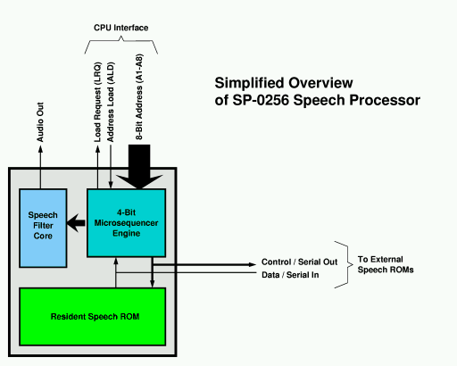
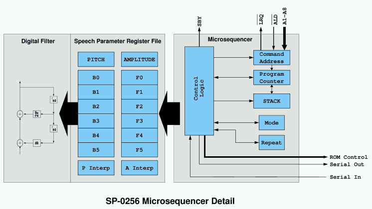
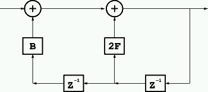

------------------------------------------------------------------------

# SP0256 Instruction Set

- Revised: 23-Sep-2000, J. Zbiciak
- Reverse Engineered by Joe Zbiciak and Frank Palazzolo.

------------------------------------------------------------------------

## Introduction

------------------------------------------------------------------------

The SP-0256 Speech Processor is an extension to the General Instruments SP-0250 speech processor. The SP-0250 Speech Processor is a 12-pole IIR filter / LPC-based speech generator. It is constructed from a single two-pole filter stage and some control circuitry that multiplexes filter coefficients and samples to achieve a 12-pole filter. It provides a pitch and noise generator for exciting the filter, thus providing all of the necessary equipment for LPC-based speech synthesis.

The original SP-0250 was suitable for generating synthetic voice, but it requires significant attention from the host microprocessor as it consumed speech data. Also, the speech data itself tended to occupy quite a bit of space. The SP-0256 addresses these issues by adding a small microsequencer to the device which is responsible for updating speech core's LPC coefficients. It additionally provides a rudimentary but effective form of compression, as words and phrases could be constructed from small subroutines, and individual filter updates could be restricted to a subset of the total parameter set, encoding only the significant bits.

------------------------------------------------------------------------

## Architecture

------------------------------------------------------------------------

The SP-0256 consists of the following elements:

- A digital filter core, containing:
  - A periodic impulse and white-noise generator,
  - A 12-pole IIR filter,
  - Twelve 8-bit filter coefficient registers,
  - One 6-bit repeat register,
  - One 8-bit pitch register,
  - One 8-bit amplitude register,
  - Two 8-bit interpolation registers, one for pitch, one for amplitude, and
  - One 8-bit to 10-bit translation ROM for expanding filter coefficients. (This ROM is not accessible from the sequencer.)
- A small microsequencer, containing:
  - One 16-bit program counter,
  - A single-level program stack,
  - An 8-bit "command address" register,
  - A 2-bit` MODE `register,
  - A 2-bit repeat prefix,
  - Control logic for interpreting an instruction stream.

This diagram gives a rough overview of the SP-0256's architecture:

The digital filter contains all of the pieces necessary to generate the actual speech sounds. The impulse generator and IIR filter model the vocal tract by shaping the periodic impulses in a similar manner to how the human vocal tract shapes sound. This core operates largely independently of the microsequencer, except that it relies on the microsequencer to receive parameter updates, and it notifies the microsequencer when it completes an utterance.

The microsequencer is a simple machine which focuses soley on copying parameters from its input to the filter parameter registers in the filter core. It can zero, replace or delta-update the existing values of the filter registers. It is also capable of branching and jumping to subroutines. The sequencer is not Turing complete, in that it is not capable of conditional flow.

In order to control the filter core, the microsequencer can address 17 different registers in the filter core. Those registers are:

| Register                    | Size   | Purpose                                                                                                                                               |
|-----------------------------|--------|-------------------------------------------------------------------------------------------------------------------------------------------------------|
| ` Repeat `                  | 6 bits | Repeat counter                                                                                                                                        |
| ` Pitch `                   | 8 bits | Pitch period. A period of 0 generates white noise for *unvoiced* sounds.                                                                              |
| `Amplitude`                 | 8 bits | Speech amplitude, in floating-point format. It is divided into two fields -- the 3 MSBs provide the *exponent* and the 5 LSBs provide the *mantissa.* |
| ` B0 `                      | 8 bits | Filter coefficients                                                                                                                                   |
| ` F0 `                      | 8 bits |                                                                                                                                                       |
| ` B1 `                      | 8 bits |                                                                                                                                                       |
| ` F1 `                      | 8 bits |                                                                                                                                                       |
| ` B2 `                      | 8 bits |                                                                                                                                                       |
| ` F2 `                      | 8 bits |                                                                                                                                                       |
| ` B3 `                      | 8 bits |                                                                                                                                                       |
| ` F3 `                      | 8 bits |                                                                                                                                                       |
| ` B4 `                      | 8 bits |                                                                                                                                                       |
| ` F4 `                      | 8 bits |                                                                                                                                                       |
| ` B5 `                      | 8 bits |                                                                                                                                                       |
| ` F5 `                      | 8 bits |                                                                                                                                                       |
| ` Pitch Interpolation `     | 8 bits | Delta update value applied to pitch after each period.                                                                                                |
| ` Amplitude Interpolation ` | 8 bits | Delta update value applied to amplitude after each period.                                                                                            |

Additionally, the microsequencer has a couple registers of its own. These registers primarily control how the microsequencer behaves.

| Register          | Size    | Purpose                                                                                                                                                                                                                                                                                                                                                                                                                                                                                         |
|-------------------|---------|-------------------------------------------------------------------------------------------------------------------------------------------------------------------------------------------------------------------------------------------------------------------------------------------------------------------------------------------------------------------------------------------------------------------------------------------------------------------------------------------------|
| ` MODE `          | 2 bits  | Controls the format of data which follows various instructions. In some cases, it also controls whether certain filter coefficients are zeroed or left unmodified. The exact meaning of` MODE ` varies by instruction.` MODE ` is *sticky*, meaning that once it is set, it retains its value until it is explicitly changed by Opcode [1000](#opcode_1000) (`SETMODE`) or the sequencer halts.                                                                                                 |
| ` REPEAT PREFIX ` | 2 bits  | The parameter load instructions can provide a four bit repeat value to the filter core. This register optionally extends that four bit value by providing two more significant bits in the 2 MSBs. By setting the repeat prefix with Opcode [1000](#opcode_1000) (`SETMODE`), the program can specify repeat values up to \$3F (63). This register is *not* sticky.                                                                                                                             |
| ` PAGE `          | 4 bits  | The` PAGE `register acts as a prefix, providing the upper four address bits for every` `[`JMP`](#opcode_0111)` ` and` `[`JSR`](#opcode_1011)` ` instruction. The` PAGE ` register can hold any binary value from 0001 to 1111, and is set by the` `[`SETPAGE`](#opcode_0000)` ` instruction. It is not possible to load it with 0000. It powers up to the value 0001, and it retains its value across` JMP/JSR `instructions as well as sequencer halts.                                        |
| ` PC `            | 16 bits | This is the program counter. This counter tracks the address of the *byte* that is currently being processed. A copy of the program counter is kept in every Speech ROM that is attached to the SP0256, so that the program counter is only broadcast on [`JMP`](#opcode_0111)` ` or` `[`JSR`](#opcode_1011).                                                                                                                                                                                   |
| ` STACK `         | 16 bits | This is where the program counter is saved when performing a` `[`JSR`](#opcode_1011). The` STACK ` has room for exactly one address, so nested subroutines are not possible. It holds the address of the *byte* following the` JSR ` instruction.                                                                                                                                                                                                                                               |
| ` COMMAND `       | 8 bits  | This holds address of the most recent command from the host CPU. Addresses are loaded into this register via external pins and the` ALD ` control line. When the microsequencer is halted (or is about to halt), it watches for an address in this register. When a new command address is available, it copies these bits to bits 1 through 8 of the program counter. Bits 0, 9 through 11, and 13 through 15 are forced to zero. Bit 12 is forced to 1 so that code executes out of page \$1. |

This diagram gives a conceptual overview of how the microsequencer interfaces to the rest of the machine.

------------------------------------------------------------------------

## General Notes Regarding the SP-0256 Instruction Set

------------------------------------------------------------------------

The microsequencer's instruction set can be divided into three primary categories:

- Speech parameter updates (replacement or delta-update),
- Control transfer ([`JMP`](#opcode_0111)`, `[`JSR`](#opcode_1011)` `and` `[`RTS`](#opcode_0000)), and
- Microsequencer mode/state updates ([`SETMODE`](#opcode_1000)` `and` `[`SETPAGE`](#opcode_0000)).

Speech parameter updates are generally followed by a data block whose format depends on the particular instruction issued. Most of these instructions only update a subset of the total speech parameter set, and often they update only the most significant bits of the registers they modify. The data blocks themselves are a variable number of bits, and are *not* constrained to byte boundaries.

The instruction stream itself is processed as a sequence of bits, not bytes, and so instructions and their data blocks can start on any bit boundary. Ordinarily, there are no gaps between instructions, and so the machine largely behaves as a bit-aligned machine. Control transfer instructions introduce *alignment points*, as all addresses in the system are byte addresses, and so all branch targets (including the return-branch target for` `[`RTS`](#opcode_0000)) are on byte boundaries. It is customary to pad the data stream with 0s at alignment points (eg. after` `[`JSR`](#opcode_1011)` `instructions).

The instruction reference below shows the exact data formats that each instruction requires. Note that the data format for an instruction varies according to the current` MODE `setting, and so the machine provides a large variety of data formats.

Other important things to note are:

- On instructions that accept a repeat count, a repeat count of **zero** causes the instruction to **not execute**, which means that ***no data block follows the instruction*** in that case. (My disassembler currently does **not** handle this case.)

- As a matter of convention in this document, bits are packed into bytes left-to-right, with the leftmost bit going in the MSB of the first byte, and the LSB of the first byte being logically adjacent to the MSB of the second byte. This is likely backwards from how the hardware looks at it, but it is the most natural for a human interpreting the data, as it reads from left-to-right.

- Most bit fields, except those which specify branch targets, are bit reversed, meaning the left-most bit is the LSB.

- Bit fields narrower than 8 bits are *MSB justified* unless specified otherwise, meaning that the least significant bits are the ones that are missing. These LSBs are filled with zeros.

- When updating filter coefficients with a delta-update, the microsequencer performs plain 2s-complement arithmetic on the 8-bit value in the coefficient register file. No attention is paid to the format of the register.

Key for opcode formats below

Field

Description

` AAAAAAAA `

Amplitude bits. The 3 rightmost bits are the exponent. The exponent determines what power of 2 is applied to the lower 5 bits.

` PPPPPPPP `

Pitch period. When set to 0, the impulse switches to random noise. For timing purposes, noise and silence have an effective period equivalent to period==64.

` BBBBBBBS `

B coefficient data. The 'S' is the sign bit, if present. If there is no 'S' on a given field, the sign is assumed to be 0.

` FFFFFFFS `

F coefficient data.

` RRRR `

Repeat bits. On Opcode [1000](#opcode_1000) (`SETMODE`), the repeat bits go to the two MSBs of the repeat count for the *next* instruction. On all other instructions, the repeat bits go to the four LSBs of the repeat count for the *current* instruction.

` MM `

Mode bits. These are set by Opcode [1000](#opcode_1000) (`SETMODE`), and they control the data format for a number of other instructions.

` LLLLLLLL `

Byte address for a branch target. Branch targets are 16 bits long. The` JMP/JSR `instruction provides the lower 12 bits, and the` PAGE ` register provides the upper 4 bits. The` PAGE `register is modified via the` SETPAGE `instruction, Opcode [0000](#opcode_0000).

` aaaaa `

Amplitude delta. (unsigned)

` ppppp `

Pitch delta. (unsigned)

` aaas `

Amplitude delta. (2s complement)

` ppps `

Pitch delta. (2s complement)

` bbbs fffs `

Filter coefficient deltas. (2s complement)

For reference, each 2nd order filter section looks like so. Note that "1/Z" represents a single unit delay. Altogether, there are 6 such stages, yielding a 12 pole filter. The exact ordering of the stages with respect to the coefficient data formats appears to be straightforward, with the lowest-numbered coefficient pair used in the earliest filter stage, etc.

------------------------------------------------------------------------

## Instruction Set Quick Reference

------------------------------------------------------------------------

|   Opcode    | Mnemonic                            | Description                                                                |
|:-----------:|-------------------------------------|----------------------------------------------------------------------------|
| ` 0 0 0 0 ` | ` `[`RTS/SETPAGE`](#opcode_0000)` ` | Return OR set the PAGE register                                            |
| ` 0 0 0 1 ` | ` `[`LOADALL`](#opcode_0001)` `     | Load All Parameters                                                        |
| ` 0 0 1 0 ` | ` `[`LOAD_2`](#opcode_0010)` `      | Load Pitch, Amplitude, Coefficient, and Interpolation Regsisters           |
| ` 0 0 1 1 ` | ` `[`SETMSB_3`](#opcode_0011)` `    | Load Pitch, Amplitude, MSBs of 3 Coefficients, and Interpolation Registers |
| ` 0 1 0 0 ` | ` `[`LOAD_4`](#opcode_0100)` `      | Load Pitch, Amplitude, Coefficients (2 or 3 stages)                        |
| ` 0 1 0 1 ` | ` `[`SETMSB_5`](#opcode_0101)` `    | Load Pitch, Amplitude, and MSBs of 3 Coefficients                          |
| ` 0 1 1 0 ` | ` `[`SETMSB_6`](#opcode_0110)` `    | Load Amplitude and MSBs of 2 or 3 Coefficients                             |
| ` 0 1 1 1 ` | ` `[`JMP`](#opcode_0111)` `         | Jump to 12-bit` PAGE`-relative Address                                     |
| ` 1 0 0 0 ` | ` `[`SETMODE`](#opcode_1000)` `     | Set the Mode bits and Repeat MSBs                                          |
| ` 1 0 0 1 ` | ` `[`DELTA_9`](#opcode_1001)` `     | Delta update Amplitude, Pitch and 5 or 6 Coefficients                      |
| ` 1 0 1 0 ` | ` `[`SETMSB_A`](#opcode_1010)` `    | Load Amplitude and MSBs of 3 Coefficients                                  |
| ` 1 0 1 1 ` | ` `[`JSR`](#opcode_1011)` `         | Jump to Subroutine (12-bit `PAGE`-Relative Address)                        |
| ` 1 1 0 0 ` | ` `[`LOAD_C`](#opcode_1100)` `      | Load Pitch, Amplitude, Coefficients (5 or 6 stages)                        |
| ` 1 1 0 1 ` | ` `[`DELTA_D`](#opcode_1101)` `     | Delta update Amplitude, Pitch and 2 or 3 Coefficients                      |
| ` 1 1 1 0 ` | ` `[`LOAD_E`](#opcode_1110)` `      | Load Pitch, Amplitude                                                      |
| ` 1 1 1 1 ` | ` `[`PAUSE`](#opcode_1111)` `       | Silent pause                                                               |

------------------------------------------------------------------------

## Individual Instruction Descriptions

------------------------------------------------------------------------

\[[Ref](#quick_ref)\] \[[Top](#top)\]

<table data-border="1" width="100%" data-cellpadding="5">
<colgroup>
<col style="width: 33%" />
<col style="width: 33%" />
<col style="width: 33%" />
</colgroup>
<thead>
<tr class="header">
<th style="text-align: right;" width="10%">OPCODE <code>0000</code></th>
<th width="15%"><code> RTS / SETPAGE </code></th>
<th style="text-align: left;" width="76%">Return <em>or</em> set the<code> PAGE </code>register</th>
</tr>
</thead>
<tbody>
<tr class="odd">
<th style="text-align: right;">Format</th>
<td colspan="2"><code> LLLL 0000 </code></td>
</tr>
<tr class="even">
<th style="text-align: right;">Action</th>
<td colspan="2">
It slices, it dices, it juliennes! It's a floor wax! It's a dessert topping! It's two instructions in one!

<ul>
<li>
<strong><code> SETPAGE </code></strong>

When<code> LLLL </code>is non-zero, this instruction sets the<code> PAGE </code> register to the value in<code> LLLL</code>. The<code> PAGE </code>register determines which 4K page (eg. the upper four bits of the address for) the next<code> JMP </code>or<code> JSR </code>will jump to. (Note that address loads via<code> ALD </code>appear to ignore<code> PAGE</code>, and set the four MSBs to $1000. They do not modify the<code> PAGE </code>register, so subsequent<code> JMP/JSR </code> instructions will jump relative to the current value in<code> PAGE</code>.)

The<code> PAGE </code>register retains its setting until the next<code> SETPAGE </code> is encountered. Valid values for<code> PAGE </code>are in the range $1..$F. The<code> RESROM </code>starts at address $1000, and no code exists below that address. Therefore, the microsequencer can address speech data over the address range $1000 through $FFFF, for a total of 60K of speech data. (Up to 64K may be possible by jumping to a location near $FFFF and letting the address wrap around. At this time, the exact behavior of an address wraparound is unknown, and may be dependent on the behavior of both the microsequencer <em>and</em> the attached speech ROMs.)
</li>
<li>
<strong><code> RTS </code></strong>

When<code> LLLL </code>is zero, this opcode causes the microsequencer to pop the PC stack into the PC, and resume execution there. The contents of the stack are replaced with $0000 (or some other flag which represents an <em>empty stack</em>). If the address that was popped was itself $0000 (eg. an <em>empty stack</em>), execution <strong>halts</strong>, pending a new address write via<code> ALD</code>. (Of course, if an address was previously written via<code> ALD </code>and is pending, control transfers to that address immediately.)
</li>
</ul></td>
</tr>
</tbody>
</table>

------------------------------------------------------------------------

\[[Ref](#quick_ref)\] \[[Top](#top)\]

OPCODE `0001`

` LOADALL `

Load All Parameters

Format

` RRRR 0001 ` *\[data\]*

Data Formats,
by` MODE`

`MODE `*`x`*`0`

    AAAAAAAA PPPPPPPP
    BBBBBBBS FFFFFFFS   (coeff pair 0)
    BBBBBBBS FFFFFFFS   (coeff pair 1)
    BBBBBBBS FFFFFFFS   (coeff pair 2)
    BBBBBBBS FFFFFFFS   (coeff pair 3)
    BBBBBBBS FFFFFFFS   (coeff pair 4)
    BBBBBBBS FFFFFFFS   (coeff pair 5)

`MODE `*`x`*`1`

    AAAAAAAA PPPPPPPP
    BBBBBBBS FFFFFFFS   (coeff pair 0)
    BBBBBBBS FFFFFFFS   (coeff pair 1)
    BBBBBBBS FFFFFFFS   (coeff pair 2)
    BBBBBBBS FFFFFFFS   (coeff pair 3)
    BBBBBBBS FFFFFFFS   (coeff pair 4)
    BBBBBBBS FFFFFFFS   (coeff pair 5)
    aaaaaaas ppppppps   (pitch and amplitude interpolation)

Action

Loads amplitude, pitch, and all coefficient pairs at full 8-bit precision.

Notes

- The pitch and amplitude deltas that are available in Mode 01 and 11 are applied *every* pitch period, not just once. Wraparound may occur. If the Pitch goes to zero, the periodic excitation switches to noise.

------------------------------------------------------------------------

\[[Ref](#quick_ref)\] \[[Top](#top)\]

<table data-border="1" width="100%" data-cellpadding="5">
<colgroup>
<col style="width: 33%" />
<col style="width: 33%" />
<col style="width: 33%" />
</colgroup>
<thead>
<tr class="header">
<th style="text-align: right;" width="10%">OPCODE <code>0010</code></th>
<th width="15%"><code> LOAD_2 </code></th>
<th style="text-align: left;" width="75%">Load Pitch, Amplitude, Coefficients, and Interpolation registers.</th>
</tr>
</thead>
<tbody>
<tr class="odd">
<td style="text-align: right;">Format</td>
<td colspan="2"><code> RRRR 0010 </code> <em>[data]</em></td>
</tr>
<tr class="even">
<td rowspan="4" style="text-align: right;">Data Formats, 
by<code> MODE</code></td>
<td style="text-align: right;" data-valign="center"><code>MODE 00</code></td>
<td><pre><code>AAAAAA   PPPPPPPP
BBB      FFFFS      (coeff pair 0)
BBB      FFFFS      (coeff pair 1)
BBB      FFFFS      (coeff pair 2)
BBBB     FFFFFS     (coeff pair 3)
BBBBBBS  FFFFFS     (coeff pair 4)
aaaaa    ppppp      (Interpolation register LSBs) </code></pre></td>
</tr>
<tr class="odd">
<td style="text-align: right;" data-valign="center"><code>MODE 01</code></td>
<td><pre><code>AAAAAA   PPPPPPPP
BBB      FFFFS      (coeff pair 0)
BBB      FFFFS      (coeff pair 1)
BBB      FFFFS      (coeff pair 2)
BBBB     FFFFFS     (coeff pair 3)
BBBBBBS  FFFFFS     (coeff pair 4)
BBBBBBBS FFFFFFFS   (coeff pair 5)
aaaaa    ppppp      (Interpolation register LSBs) </code></pre></td>
</tr>
<tr class="even">
<td style="text-align: right;" data-valign="center"><code>MODE 10</code></td>
<td><pre><code>AAAAAA   PPPPPPPP
BBBBBB   FFFFFS     (coeff pair 0)
BBBBBB   FFFFFS     (coeff pair 1)
BBBBBB   FFFFFS     (coeff pair 2)
BBBBBB   FFFFFFS    (coeff pair 3)
BBBBBBBS FFFFFFFS   (coeff pair 4)
aaaaa    ppppp      (Interpolation register LSBs) </code></pre></td>
</tr>
<tr class="odd">
<td style="text-align: right;" data-valign="center"><code>MODE 11</code></td>
<td><pre><code>AAAAAA   PPPPPPPP
BBBBBB   FFFFFS     (coeff pair 0)
BBBBBB   FFFFFS     (coeff pair 1)
BBBBBB   FFFFFS     (coeff pair 2)
BBBBBB   FFFFFFS    (coeff pair 3)
BBBBBBBS FFFFFFFS   (coeff pair 4)
BBBBBBBS FFFFFFFS   (coeff pair 5)
aaaaa    ppppp      (Interpolation register LSBs) </code></pre></td>
</tr>
<tr class="even">
<td style="text-align: right;">Action</td>
<td colspan="2">Loads new amplitude and pitch parameters. Also loads a set of new filter coefficients, setting the unspecified coefficients to zero. The exact combination and precision of filter coefficients that are loaded is determined by which prefix is used. Opcode <a href="#opcode_1000">1000</a> (<code>SETMODE</code>) provides the prefix bits.</td>
</tr>
<tr class="odd">
<td style="text-align: right;">Notes</td>
<td colspan="2"><ul>
<li>For all Modes, the Sign bit for B0, B1, B2 and B3 (the B coeffs for pair 0 thru pair 3) has an implied value of 0.</li>
<li>This opcode is identical to Opcode <a href="#opcode_1100">1100</a> (<code>LOAD_C</code>), except that it also loads new values into the Amplitude and Pitch Interpolation Registers.</li>
</ul></td>
</tr>
</tbody>
</table>

------------------------------------------------------------------------

\[[Ref](#quick_ref)\] \[[Top](#top)\]

<table data-border="1" width="100%" data-cellpadding="5">
<colgroup>
<col style="width: 33%" />
<col style="width: 33%" />
<col style="width: 33%" />
</colgroup>
<thead>
<tr class="header">
<th style="text-align: right;" width="10%">OPCODE <code>0011</code></th>
<th width="15%"><code> SETMSB_3 </code></th>
<th style="text-align: left;" width="75%">Load Pitch, Amplitude, MSBs of 3 Coefficients, and Interpolation Registers.</th>
</tr>
</thead>
<tbody>
<tr class="odd">
<td style="text-align: right;">Format</td>
<td colspan="2"><code> RRRR 0011 </code> <em>[data]</em></td>
</tr>
<tr class="even">
<td rowspan="2" style="text-align: right;">Data Formats, 
by<code> MODE</code></td>
<td style="text-align: right;" data-valign="center"><code>MODE 0</code><em><code>x</code></em></td>
<td><pre><code>AAAAAA
FFFFS               (New F0 MSBs)
FFFFS               (New F1 MSBs)
FFFFS               (New F2 MSBs)
aaaaa    ppppp      (Interpolation register LSBs)</code></pre></td>
</tr>
<tr class="odd">
<td style="text-align: right;" data-valign="center"><code>MODE 1</code><em><code>x</code></em></td>
<td><pre><code>AAAAAA
FFFFFS              (New F0 MSBs)
FFFFFS              (New F1 MSBs)
FFFFFS              (New F2 MSBs)
aaaaa    ppppp      (Interpolation register LSBs)</code></pre></td>
</tr>
<tr class="even">
<td style="text-align: right;">Action</td>
<td colspan="2">Loads new amplitude. Also updates the MSBs of a set of new filter coefficients. The Mode prefix bits controls the update process as noted below. Opcode <a href="#opcode_1000">1000</a> (<code>SETMODE</code>) provides the prefix bits.</td>
</tr>
<tr class="odd">
<td style="text-align: right;">Notes</td>
<td colspan="2"><ul>
<li>When<code> MODE </code>is 00 or 10, the parameter load sets the 5 or 6 MSBs of<code> F0</code>,<code> F1</code>, and<code> F2 </code> from the data provided. <code> F5 </code>and<code> B5 </code> are set to all 0s. All other coefficient bits are unaffected.</li>
<li>When<code> MODE </code>is 01 or 11, the parameter load sets the 5 or 6 MSBs of<code> F0</code>,<code> F1</code>, and<code> F2 </code> from the data provided. <code> F5 </code>and<code> B5 </code>are not modified. All other coefficient bits are unaffected.</li>
<li>This opcode is identical to Opcodes <a href="#opcode_0101">0101</a> (<code>SETMSB_5</code>) and <a href="#opcode_1010">1010</a> (<code>SETMSB_A</code>), except that is also includes the Interpolation Registers, and like Opcode <a href="#opcode_1010">1010</a> (<code>SETMSB_A</code>), it does not set the Pitch Registers.</li>
</ul></td>
</tr>
</tbody>
</table>

------------------------------------------------------------------------

\[[Ref](#quick_ref)\] \[[Top](#top)\]

OPCODE `0100`

` LOAD_4 `

Load Pitch, Amplitude, Coefficients (2 or 3 stages)

Format

` RRRR 0100 ` *\[data\]*

Data Formats,
by` MODE`

`MODE 00`

    AAAAAA   PPPPPPPP
    BBBB     FFFFFS     (coeff pair 3)
    BBBBBBS  FFFFFS     (coeff pair 4)

`MODE 01`

    AAAAAA   PPPPPPPP
    BBBB     FFFFFS     (coeff pair 3)
    BBBBBBS  FFFFFS     (coeff pair 4)
    BBBBBBBS FFFFFFFS   (coeff pair 5)

`MODE 10`

    AAAAAA   PPPPPPPP
    BBBBBB   FFFFFFS    (coeff pair 3)
    BBBBBBBS FFFFFFFS   (coeff pair 4)

`MODE 11`

    AAAAAA   PPPPPPPP
    BBBBBB   FFFFFFS    (coeff pair 3)
    BBBBBBBS FFFFFFFS   (coeff pair 4)
    BBBBBBBS FFFFFFFS   (coeff pair 5)

Action

Loads new amplitude and pitch parameters. Also loads a set of new filter coefficients, setting the unspecified coefficients to 0. The exact combination and precision of filter coefficients that are loaded is determined by which prefix is used. Opcode [1000](#opcode_1000) (`SETMODE`) provides the prefix bits.

Notes

- For all modes, the Sign bit for` B0 `(the ` B `coefficient for pair 0) has an implied value of 0.

------------------------------------------------------------------------

\[[Ref](#quick_ref)\] \[[Top](#top)\]

<table data-border="1" width="100%" data-cellpadding="5">
<colgroup>
<col style="width: 33%" />
<col style="width: 33%" />
<col style="width: 33%" />
</colgroup>
<thead>
<tr class="header">
<th style="text-align: right;" width="10%">OPCODE <code>0101</code></th>
<th width="15%"><code> SETMSB_5 </code></th>
<th style="text-align: left;" width="75%">Load Pitch, Amplitude, and MSBs of 3 Coefficients</th>
</tr>
</thead>
<tbody>
<tr class="odd">
<td style="text-align: right;">Format</td>
<td colspan="2"><code> RRRR 0101 </code> <em>[data]</em></td>
</tr>
<tr class="even">
<td rowspan="2" style="text-align: right;">Data Formats, 
by<code> MODE</code></td>
<td style="text-align: right;" data-valign="center"><code>MODE 0</code><em><code>x</code></em></td>
<td><pre><code>AAAAAA PPPPPPPP
FFFFS               (New F0 MSBs)
FFFFS               (New F1 MSBs)
FFFFS               (New F2 MSBs)</code></pre></td>
</tr>
<tr class="odd">
<td style="text-align: right;" data-valign="center"><code>MODE 1</code><em><code>x</code></em></td>
<td><pre><code>AAAAAA PPPPPPPP
FFFFFS              (New F0 MSBs)
FFFFFS              (New F1 MSBs)
FFFFFS              (New F2 MSBs)</code></pre></td>
</tr>
<tr class="even">
<td style="text-align: right;">Action</td>
<td colspan="2">Loads new amplitude and pitch parameters. Also updates the MSBs of a set of new filter coefficients. The Mode prefix bits controls the update process as noted below. Opcode <a href="#opcode_1000">1000</a> (<code>SETMODE</code>) provides the prefix bits.</td>
</tr>
<tr class="odd">
<td style="text-align: right;">Notes</td>
<td colspan="2"><ul>
<li>When<code> MODE </code>is 00 or 10, the parameter load sets the 5 or 6 MSBs of<code> F0</code>,<code> F1</code>, and<code> F2 </code>from the data provided.<code> F5 </code>and<code> B5 </code>are set to all 0s. All other coefficient bits are unaffected.</li>
<li>When<code> MODE </code>is 01 or 11, the parameter load sets the 5 or 6 MSBs of<code> F0</code>,<code> F1</code>, and<code> F2 </code>from the data provided. F5 and B5 are not modified. All other coefficient bits are unaffected.</li>
<li>This opcode is identical to Opcodes <a href="#opcode_0011">0011</a> (<code>SETMSB_3</code>) and <a href="#opcode_1010">1010</a> (<code>SETMSB_A</code>), only Pitch <em>is</em> modified, and unlike Opcode <a href="#opcode_0011">0011</a>, the interpolation registers are not set.</li>
</ul></td>
</tr>
</tbody>
</table>

------------------------------------------------------------------------

\[[Ref](#quick_ref)\] \[[Top](#top)\]

OPCODE `0110`

` SETMSB_6 `

Load Amplitude and MSBs of 2 or 3 Coeffcients

Format

` RRRR 0110 ` *\[data\]*

Data Formats,
by` MODE`

`MODE 00`

    AAAAAA
    FFFFFS              (New F3 6 MSBs)
    FFFFFS              (New F4 6 MSBs)

`MODE 01`

    AAAAAA
    FFFFFS              (New F3 6 MSBs)
    FFFFFS              (New F4 6 MSBs)
    FFFFFFFS            (New F5 8 MSBs)

`MODE 10`

    AAAAAA
    FFFFFFS             (New F3 7 MSBs)
    FFFFFFFS            (New F4 8 MSBs)

`MODE 11`

    AAAAAA
    FFFFFFS             (New F3 7 MSBs)
    FFFFFFFS            (New F4 8 MSBs)
    FFFFFFFS            (New F5 8 MSBs)

Action

Loads new amplitude and pitch parameters. Also updates the MSBs of a set of new filter coefficients. The` MODE ` prefix bits controls the update process as noted below. Opcode [1000](#opcode_1000) (`SETMODE`) provides the prefix bits.

Notes

- For` MODE `00 and 10, coefficients` B5 `and` F5 `are set to zero.
- For` MODE `01 and 11, coefficient` F5 `is set from the last 8 bits of the data provided, and` B5 `is not modified.
- For` MODE `00 and 01, the 6 MSBs of` F3 `and` F4 `are set from the first 12 bits provided. The other bits of` F3 `and` F4 `are not modified.
- For` MODE `10 and 11, the 7 MSBs of` F3 `and the 8 MSBs of` F4 `are set from the first 12 bits provided. The LSB of` F3 `is not modified.

------------------------------------------------------------------------

\[[Ref](#quick_ref)\] \[[Top](#top)\]

<table data-border="1" width="100%" data-cellpadding="5">
<colgroup>
<col style="width: 33%" />
<col style="width: 33%" />
<col style="width: 33%" />
</colgroup>
<thead>
<tr class="header">
<th style="text-align: right;" width="10%">OPCODE <code>0111</code></th>
<th width="15%"><code> JMP </code></th>
<th style="text-align: left;" width="75%">Jump to 12-bit<code> PAGE</code>-Relative Address</th>
</tr>
</thead>
<tbody>
<tr class="odd">
<th style="text-align: right;">Format</th>
<td colspan="2"><code> LLLL 0111 LLLLLLLL </code></td>
</tr>
<tr class="even">
<th style="text-align: right;">Action</th>
<td colspan="2">
Performs a jump to the specified 12-bit address relative to the 4K page number specified by the<code> PAGE </code>register. That is, the<code> JMP </code>instruction jumps to the location<code> PAGE LLLL LLLLLLLL</code>, where the upper four bits come from the<code> PAGE </code> register and the lower 12 bits come from the<code> JMP </code> instruction.

At power-up, the<code> PAGE </code>register defaults to the value 0001 ($1). The<code> PAGE </code>register may be set using the<code> SETPAGE </code>instruction, Opcode <a href="#opcode_0000">0000</a>.
</td>
</tr>
</tbody>
</table>

------------------------------------------------------------------------

\[[Ref](#quick_ref)\] \[[Top](#top)\]

<table data-border="1" width="100%" data-cellpadding="5">
<colgroup>
<col style="width: 33%" />
<col style="width: 33%" />
<col style="width: 33%" />
</colgroup>
<thead>
<tr class="header">
<th style="text-align: right;" width="10%">OPCODE <code>1000</code></th>
<th width="15%"><code> SETMODE </code></th>
<th style="text-align: left;" width="75%">Set the<code> MODE </code>bits and Repeat MSBs</th>
</tr>
</thead>
<tbody>
<tr class="odd">
<th style="text-align: right;">Format</th>
<td colspan="2"><code> RRMM 1000 </code></td>
</tr>
<tr class="even">
<th style="text-align: right;">Action</th>
<td colspan="2">
Serves as a prefix to many other instructions. The upper two bits of the immediate constant are loaded into the upper two bits of the 6-bit repeat register. These two bits combine with the four LSBs that are provided by most parameter-load instructions to provide longer repetition periods.

The two<code> MM </code>bits select the data format / coefficient count for many of the parameter load instructions.

This opcode is known to have <em>no</em> effect on<code> JMP/JSR </code>instructions and<code> JMP/JSR </code>instructions have no effect on it.
</td>
</tr>
<tr class="odd">
<th style="text-align: right;">Notes</th>
<td colspan="2"><ul>
<li>The<code> MM </code>mode bits are <em>sticky</em>, meaning that they stay in effect until the next Opcode <a href="#opcode_1000">1000</a> (<code>SETMODE</code>) instruction. The<code> RR </code>repeat bits are not, however.</li>
</ul></td>
</tr>
</tbody>
</table>

------------------------------------------------------------------------

\[[Ref](#quick_ref)\] \[[Top](#top)\]

<table data-border="1" width="100%" data-cellpadding="5">
<colgroup>
<col style="width: 33%" />
<col style="width: 33%" />
<col style="width: 33%" />
</colgroup>
<thead>
<tr class="header">
<th style="text-align: right;" width="10%">OPCODE <code>1001</code></th>
<th width="15%"><code> DELTA_9 </code></th>
<th style="text-align: left;" width="75%">Delta update Amplitude, Pitch and 5 or 6 Coefficients</th>
</tr>
</thead>
<tbody>
<tr class="odd">
<td style="text-align: right;">Format</td>
<td colspan="2"><code> RRRR 1001 </code> <em>[data]</em></td>
</tr>
<tr class="even">
<td rowspan="4" style="text-align: right;">Data Formats, 
by<code> MODE</code></td>
<td style="text-align: right;" data-valign="center"><code>MODE 00</code></td>
<td><pre><code>aaas     pppps      (Amplitude 6 MSBs, Pitch LSBs.)
bbs      ffs        (B0 4 MSBs, F0 5 MSBs.)
bbs      ffs        (B1 4 MSBs, F1 5 MSBs.)
bbs      ffs        (B2 4 MSBs, F2 5 MSBs.)
bbs      fffs       (B3 5 MSBs, F3 6 MSBs.)
bbbs     fffs       (B4 6 MSBs, F4 6 MSBs.)</code></pre></td>
</tr>
<tr class="odd">
<td style="text-align: right;" data-valign="center"><code>MODE 01</code></td>
<td><pre><code>aaas     pppps      (Amplitude 6 MSBs, Pitch LSBs.)
bbs      ffs        (B0 4 MSBs, F0 5 MSBs.)
bbs      ffs        (B1 4 MSBs, F1 5 MSBs.)
bbs      ffs        (B2 4 MSBs, F2 5 MSBs.)
bbs      fffs       (B3 5 MSBs, F3 6 MSBs.)
bbbs     fffs       (B4 6 MSBs, F4 6 MSBs.)
bbbbs    ffffs      (B5 8 MSBs, F5 8 MSBs.)</code></pre></td>
</tr>
<tr class="even">
<td style="text-align: right;" data-valign="center"><code>MODE 10</code></td>
<td><pre><code>aaas     pppps      (Amplitude 6 MSBs, Pitch LSBs.)
bbbs     fffs       (B0 7 MSBs, F0 6 MSBs.)
bbbs     fffs       (B1 7 MSBs, F1 6 MSBs.)
bbbs     fffs       (B2 7 MSBs, F2 6 MSBs.)
bbbs     ffffs      (B3 7 MSBs, F3 7 MSBs.)
bbbbs    ffffs      (B4 8 MSBs, F4 8 MSBs.)</code></pre></td>
</tr>
<tr class="odd">
<td style="text-align: right;" data-valign="center"><code>MODE 11</code></td>
<td><pre><code>aaas     pppps      (Amplitude 6 MSBs, Pitch LSBs.)
bbbs     fffs       (B0 7 MSBs, F0 6 MSBs.)
bbbs     fffs       (B1 7 MSBs, F1 6 MSBs.)
bbbs     fffs       (B2 7 MSBs, F2 6 MSBs.)
bbbs     ffffs      (B3 7 MSBs, F3 7 MSBs.)
bbbbs    ffffs      (B4 8 MSBs, F4 8 MSBs.)
bbbbs    ffffs      (B5 8 MSBs, F5 8 MSBs.)</code></pre></td>
</tr>
<tr class="even">
<td style="text-align: right;">Action</td>
<td colspan="2">Performs a delta update, adding small 2s complement numbers to a series of coefficients. The 2s complement updates for the various filter coefficients only update some of the MSBs -- the LSBs are unaffected. The exact bits which are updated are noted above.</td>
</tr>
<tr class="odd">
<td style="text-align: right;">Notes</td>
<td colspan="2"><ul>
<li>The delta update is applied exactly once, as long as the repeat count is at least 1. If the repeat count is greater than 1, the updated value is held through the repeat period, but the delta update is not reapplied.</li>
<li>The delta updates are applied to the 8-bit encoded forms of the coefficients, not the 10-bit decoded forms.</li>
<li>Normal 2s complement arithmetic is performed, and no protection is provided against overflow. Adding 1 to the largest value for a bit field wraps around to the smallest value for that bitfield.</li>
<li>The update to the amplitude register is a normal 2s complement update to the <em>entire</em> register. This means that any carry/borrow from the mantissa will change the value of the exponent. The update doesn't know anything about the format of that register.</li>
</ul></td>
</tr>
</tbody>
</table>

------------------------------------------------------------------------

\[[Ref](#quick_ref)\] \[[Top](#top)\]

OPCODE `1010`

` SETMSB_A `

Load Amplitude and MSBs of 3 Coefficients

Format

` RRRR 1010 ` *\[data\]*

Data Formats,
by` MODE`

`MODE 0`*`x`*

    AAAAAA
    FFFFS               (New F0 MSBs)
    FFFFS               (New F1 MSBs)
    FFFFS               (New F2 MSBs)

`MODE 1`*`x`*

    AAAAAA
    FFFFFS              (New F0 MSBs)
    FFFFFS              (New F1 MSBs)
    FFFFFS              (New F2 MSBs)

Action

Loads new amplitude. Also updates the MSBs of a set of new filter coefficients. The` MODE `prefix bits controls the update process as noted below. Opcode [1000](#opcode_1000) (`SETMODE`) provides the prefix bits.

Notes

- When` MODE `is 00 or 10, the parameter load sets the 5 or 6 MSBs of` F0`,` F1`, and` F2 `from the data provided.` F5 `and` B5 `are set to all 0s. All other coefficient bits are unaffected.
- When` MODE `is 01 or 11, the parameter load sets the 5 or 6 MSBs of` F0`,` F1`, and` F2 `from the data provided.` F5 `and` B5 `are not modified. All other coefficient bits are unaffected.
- This opcode is identical to Opcodes [0011](#opcode_0011) (`SETMSB_3`) and [0101](#opcode_0101) (`SETMSB_5`), except that Pitch is *not* modified, and the Interpolation Registers are *not* set.

------------------------------------------------------------------------

\[[Ref](#quick_ref)\] \[[Top](#top)\]

<table data-border="1" width="100%" data-cellpadding="5">
<colgroup>
<col style="width: 33%" />
<col style="width: 33%" />
<col style="width: 33%" />
</colgroup>
<thead>
<tr class="header">
<th style="text-align: right;" width="10%">OPCODE <code>1011</code></th>
<th width="15%"><code> JSR </code></th>
<th style="text-align: left;" width="75%">Jump to Subroutine (12-bit<code> PAGE</code>-Relative Address)</th>
</tr>
</thead>
<tbody>
<tr class="odd">
<th style="text-align: right;">Format</th>
<td colspan="2"><code> LLLL 1011 LLLLLLLL </code></td>
</tr>
<tr class="even">
<th style="text-align: right;">Action</th>
<td colspan="2">
Performs a jump to the specified 12-bit address relative to the 4K page number specified by the<code> PAGE </code>register. That is, the<code> JMP </code>instruction jumps to the location<code> PAGE LLLL LLLLLLLL</code>, where the upper four bits come from the<code> PAGE </code> register and the lower 12 bits come from the<code> JSR </code> instruction.

At power-up, the<code> PAGE </code>register defaults to the value 0001 ($1). The<code> PAGE </code>register may be set using the<code> SETPAGE </code>instruction, Opcode <a href="#opcode_0000">0000</a>.

This variant pushes the byte-aligned return address onto the PC stack. The previous contents of the PC stack are lost, as the PC stack is only one entry deep. To return to the next instruction, use Opcode <a href="#opcode_0000">0000</a> (<code>RTS</code>).
</td>
</tr>
</tbody>
</table>

------------------------------------------------------------------------

\[[Ref](#quick_ref)\] \[[Top](#top)\]

<table data-border="1" width="100%" data-cellpadding="5">
<colgroup>
<col style="width: 33%" />
<col style="width: 33%" />
<col style="width: 33%" />
</colgroup>
<thead>
<tr class="header">
<th style="text-align: right;" width="10%">OPCODE <code>1100</code></th>
<th width="15%"><code> LOAD_C </code></th>
<th style="text-align: left;" width="75%">Load Pitch, Amplitude, Coefficients (5 or 6 stages)</th>
</tr>
</thead>
<tbody>
<tr class="odd">
<td style="text-align: right;">Format</td>
<td colspan="2"><code> RRRR 1100 </code> <em>[data]</em></td>
</tr>
<tr class="even">
<td rowspan="4" style="text-align: right;">Data Formats, 
by<code> MODE</code></td>
<td style="text-align: right;" data-valign="center"><code>MODE 00</code></td>
<td><pre><code>AAAAAA   PPPPPPPP
BBB      FFFFS      (coeff pair 0)
BBB      FFFFS      (coeff pair 1)
BBB      FFFFS      (coeff pair 2)
BBBB     FFFFFS     (coeff pair 3)
BBBBBBS  FFFFFS     (coeff pair 4)</code></pre></td>
</tr>
<tr class="odd">
<td style="text-align: right;" data-valign="center"><code>MODE 01</code></td>
<td><pre><code>AAAAAA   PPPPPPPP
BBB      FFFFS      (coeff pair 0)
BBB      FFFFS      (coeff pair 1)
BBB      FFFFS      (coeff pair 2)
BBBB     FFFFFS     (coeff pair 3)
BBBBBBS  FFFFFS     (coeff pair 4)
BBBBBBBS FFFFFFFS   (coeff pair 5)</code></pre></td>
</tr>
<tr class="even">
<td style="text-align: right;" data-valign="center"><code>MODE 10</code></td>
<td><pre><code>AAAAAA   PPPPPPPP
BBBBBB   FFFFFS     (coeff pair 0)
BBBBBB   FFFFFS     (coeff pair 1)
BBBBBB   FFFFFS     (coeff pair 2)
BBBBBB   FFFFFFS    (coeff pair 3)
BBBBBBBS FFFFFFFS   (coeff pair 4)</code></pre></td>
</tr>
<tr class="odd">
<td style="text-align: right;" data-valign="center"><code>MODE 11</code></td>
<td><pre><code>AAAAAA   PPPPPPPP
BBBBBB   FFFFFS     (coeff pair 0)
BBBBBB   FFFFFS     (coeff pair 1)
BBBBBB   FFFFFS     (coeff pair 2)
BBBBBB   FFFFFFS    (coeff pair 3)
BBBBBBBS FFFFFFFS   (coeff pair 4)
BBBBBBBS FFFFFFFS   (coeff pair 5)</code></pre></td>
</tr>
<tr class="even">
<td style="text-align: right;">Action</td>
<td colspan="2">Loads new amplitude and pitch parameters. Also loads a set of new filter coefficients, setting the unspecified coefficients to zero. The exact combination and precision of filter coefficients that are loaded is determined by which prefix is used. Opcode <a href="#opcode_1000">1000</a> (<code>SETMODE</code>) provides the prefix bits.</td>
</tr>
<tr class="odd">
<td style="text-align: right;">Notes</td>
<td colspan="2"><ul>
<li>For all values of<code> MODE</code>, the Sign bit for<code> B0</code>,<code> B1</code>,<code> B2 </code>and<code> B3 </code>(the B coefficients for pair 0 thru pair 3) has an implied value of 0.</li>
</ul></td>
</tr>
</tbody>
</table>

------------------------------------------------------------------------

\[[Ref](#quick_ref)\] \[[Top](#top)\]

<table data-border="1" width="100%" data-cellpadding="5">
<colgroup>
<col style="width: 33%" />
<col style="width: 33%" />
<col style="width: 33%" />
</colgroup>
<thead>
<tr class="header">
<th style="text-align: right;" width="10%">OPCODE <code>1101</code></th>
<th width="15%"><code> DELTA_D </code></th>
<th style="text-align: left;" width="75%">Delta update Amplitude, Pitch and 2 or 3 Coefficients</th>
</tr>
</thead>
<tbody>
<tr class="odd">
<td style="text-align: right;">Format</td>
<td colspan="2"><code> RRRR 1101 </code> <em>[data]</em></td>
</tr>
<tr class="even">
<td rowspan="4" style="text-align: right;">Data Formats, 
by<code> MODE</code></td>
<td style="text-align: right;" data-valign="center"><code>MODE 00</code></td>
<td><pre><code>aaas     pppps      (Amplitude 6 MSBs, Pitch LSBs.)
bbs      fffs       (B3 5 MSBs, F3 6 MSBs.)
bbbs     fffs       (B4 7 MSBs, F4 6 MSBs.)</code></pre></td>
</tr>
<tr class="odd">
<td style="text-align: right;" data-valign="center"><code>MODE 01</code></td>
<td><pre><code>aaas     pppps      (Amplitude 6 MSBs, Pitch LSBs.)
bbs      fffs       (B3 5 MSBs, F3 6 MSBs.)
bbbs     fffs       (B4 7 MSBs, F4 6 MSBs.)
bbbbs    ffffs      (B5 8 MSBs, F5 8 MSBs.)</code></pre></td>
</tr>
<tr class="even">
<td style="text-align: right;" data-valign="center"><code>MODE 10</code></td>
<td><pre><code>aaas     pppps      (Amplitude 6 MSBs, Pitch LSBs.)
bbbs     ffffs      (B3 7 MSBs, F3 7 MSBs.)
bbbbs    ffffs      (B4 8 MSBs, F4 8 MSBs.)</code></pre></td>
</tr>
<tr class="odd">
<td style="text-align: right;" data-valign="center"><code>MODE 11</code></td>
<td><pre><code>aaas     pppps      (Amplitude 6 MSBs, Pitch LSBs.)
bbbs     ffffs      (B3 7 MSBs, F3 7 MSBs.)
bbbbs    ffffs      (B4 8 MSBs, F4 8 MSBs.)
bbbbs    ffffs      (B5 8 MSBs, F5 8 MSBs.)</code></pre></td>
</tr>
<tr class="even">
<td style="text-align: right;">Action</td>
<td colspan="2">Performs a delta update, adding small 2s complement numbers to a series of coefficients. The 2s complement updates for the various filter coefficients only update some of the MSBs -- the LSBs are unaffected. The exact bits which are updated are noted above.</td>
</tr>
<tr class="odd">
<td style="text-align: right;">Notes</td>
<td colspan="2"><ul>
<li>The delta update is applied exactly once, as long as the repeat count is at least 1. If the repeat count is greater than 1, the updated value is held through the repeat period, but the delta update is not reapplied.</li>
<li>The delta updates are applied to the 8-bit encoded forms of the coefficients, not the 10-bit decoded forms.</li>
<li>Normal 2s complement arithmetic is performed, and no protection is provided against overflow. Adding 1 to the largest value for a bit field wraps around to the smallest value for that bitfield.</li>
<li>The update to the amplitude register is a normal 2s complement update to the <em>entire</em> register. This means that any carry/borrow from the mantissa will change the value of the exponent. The update doesn't know anything about the format of that register.</li>
</ul></td>
</tr>
</tbody>
</table>

------------------------------------------------------------------------

\[[Ref](#quick_ref)\] \[[Top](#top)\]

| OPCODE `1110` | ` LOAD_E `                                                                                                                                                                                                                                    | Load Pitch, Amplitude |
|--------------:|-----------------------------------------------------------------------------------------------------------------------------------------------------------------------------------------------------------------------------------------------|-----------------------|
|        Format | ` RRRR 1110 AAAAAA PPPPPPPP `                                                                                                                                                                                                                 |                       |
|        Action | Loads new amplitude and pitch parameters. Data format does not seem to be affected by the Opcode [1000](#opcode_1000) (`SETMODE`) prefix, although the repeat count may be extended using the Opcode [1000](#opcode_1000) (`SETMODE`) prefix. |                       |

------------------------------------------------------------------------

\[[Ref](#quick_ref)\] \[[Top](#top)\]

<table data-border="1" width="100%" data-cellpadding="5">
<colgroup>
<col style="width: 33%" />
<col style="width: 33%" />
<col style="width: 33%" />
</colgroup>
<thead>
<tr class="header">
<th style="text-align: right;" width="10%">OPCODE <code>1111</code></th>
<th width="15%"><code> PAUSE </code></th>
<th style="text-align: left;" width="75%">Silent Pause</th>
</tr>
</thead>
<tbody>
<tr class="odd">
<th style="text-align: right;">Format</th>
<td colspan="2"><code> RRRR 1111 </code></td>
</tr>
<tr class="even">
<th style="text-align: right;">Action</th>
<td colspan="2">Provides a silent pause of varying length. The length of the pause is given by the 4-bit immediate constant<code> RRRR</code>. The pause duration can be extended with the Opcode <a href="#opcode_1000">1000</a> (<code>SETMODE</code>) prefix.</td>
</tr>
<tr class="odd">
<th style="text-align: right;">Notes</th>
<td colspan="2"><ul>
<li>The pause behaves identially to a pitch with Amplitude == 0 and Period == 64. All coefficients are cleared, as well.</li>
</ul></td>
</tr>
</tbody>
</table>

------------------------------------------------------------------------

\$Id: sp0256_instr_set.html,v 1.1 2000/09/28 00:05:49 im14u2c Exp \$
