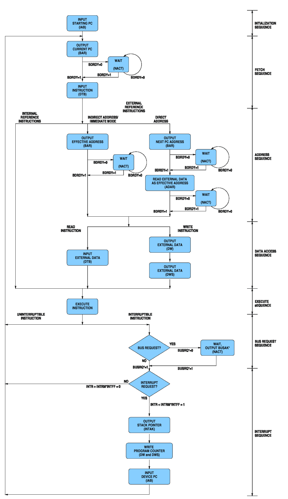

# CP-1600 State Flow Diagram

This diagram is adapted from the diagram that GI published in its CP-1600 data sheet. Many details have been added to this diagram that were omitted in the GI version of the diagram (notable, with respect to Direct-Addressing Mode instructions and their use of `ADAR`).

Not shown are the states for the various `NACT` spacing cycles that the CP-1600 introduces, other than those introduced for wait states due to `BDRDY`. Also not shown are the state transitions for reading Double-Byte Data using `SDBD`.

[View the full CP-1600 state-flow diagram](images/state_flow_diag.gif).

